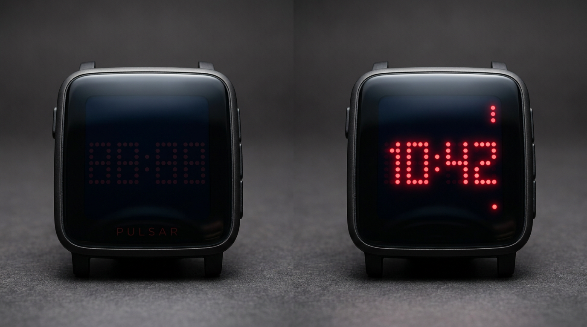

# Pulsar 1970 (Pebble Time 2 / Pebble Time Watchface)



A retro digital watchface inspired by the iconic **1970s Hamilton Pulsar** ("Time Computer" P1, P2, and P3 models)—the world's first commercial digital LED wristwatch.

Built for the **Rebble / RePebble** ecosystem with native support for the **Pebble Time 2 (`emery`)** and **Pebble Time (`basalt`)**.

---

## Features

- **Procedural 5×7 GaAsP Red Dot-Matrix LEDs:** Mathematically rendered circular LED dies that remain crisp across all resolutions without bitmap scaling artifacts.
- **Authentic Ghost Matrix:** Unlit LED dies are rendered in deep maroon (`GColorBulgarianRose`) on a pitch-black background (`GColorBlack`), mimicking the look of unlit GaAsP dies beneath a synthetic ruby mineral glass crystal.
- **Authentic 1970s Push-to-Wake (Stealth Mode):** In the 1970s, LEDs drew so much power that the display stayed dark until a button was pressed. A wrist flick or tap (`accel_tap_service_subscribe`) bursts the display into vivid red for 4 seconds before returning to stealth/ghost mode.
- **Pulsar P3 "Date Command":** Flicking or tapping toggles between current Time (`HH:MM`) and Calendar Date (`MM:DD`).
- **Responsive Platform Geometry:**
  - **Pebble Time 2 (`emery` 200×228):** 3px dot radius, 8px spacing, vintage cushion bezel chamfer, and high-density typography.
  - **Pebble Time (`basalt` 144×168):** 2px dot radius, 6px spacing, optimized for standard 64-color e-paper.
- **Hardware Indicators:**
  - Lower AM/PM LED indicator dot.
  - Bluetooth disconnect warning LED dot.
  - Low battery warning LED dot.

---

## Quickstart with Nix / Devenv

This repository includes a reproducible [`devenv.nix`](devenv.nix) providing the ARM embedded GCC cross-compiler (`gcc-arm-embedded`) and `pebble-tool`:

```bash
# 1. Enter the devenv environment
devenv shell

# 2. Build the .pbw watchface bundle for all platforms
pebble build

# 3. Test in the Pebble Time 2 emulator
pebble install --emulator emery
```

```bash
pebble build
```

### Run in Emulator

```bash
# Pebble Time 2 (Emery - 200x228)
pebble install --emulator emery

# Pebble Time (Basalt - 144x168)
pebble install --emulator basalt
```

### Sideload to Physical Watch

1. Enable **Developer Connection** in the Pebble mobile app settings.
2. Sideload over Wi-Fi:
   ```bash
   pebble install --phone <PHONE_IP_ADDRESS>
   ```

---

## License

MIT
