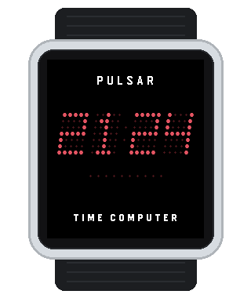
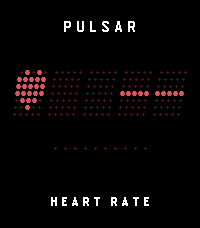
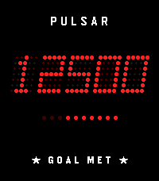
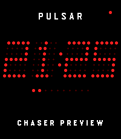
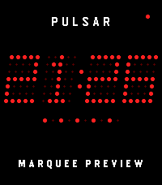
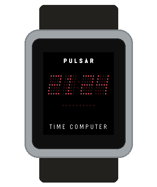
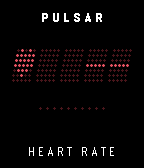
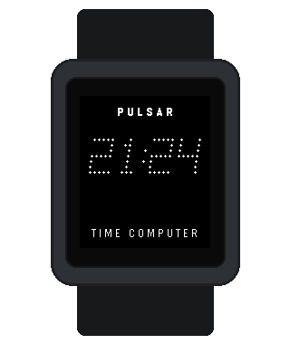
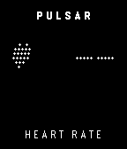
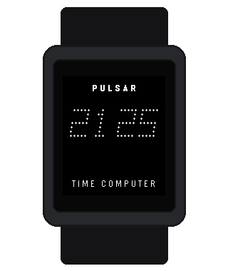

# Pulsar 1970 (Pebble Time 2 / Pebble Time Watchface)

<p align="center">
  
</p>

<p align="center">
  
  
</p>

<p align="center">
  <em>Left: Authentic Pebble Time 2 hardware in 316L brushed stainless steel with procedural GaAsP LED matrix. Right: Live wrist-flick gesture animation cycling through all 6 display modes.</em>
</p>

A high-fidelity retro digital watchface inspired by the iconic **1970s Hamilton Pulsar** ("Time Computer" P1, P2, and P3 models)—the world's first commercial digital LED wristwatch.

Built for the **Rebble / RePebble** ecosystem with native support for the **Pebble Time 2 (`emery`)**, **Pebble Time / Time Steel (`basalt`)**, **Pebble 2 (`diorite`)**, and classic **Pebble (`aplite`)**.

---

## Quick Start & Interaction Guide

### 💡 Operating Modes
* **Always-On Mode (Default):** The dot-matrix time is continuously visible with blinking colon and active status dots.
* **Stealth Mode (Authentic 1970 Push-to-Wake):** Replicates the vintage Hamilton Pulsar push-button experience where the LED display remains dark to conserve power beneath the synthetic ruby crystal. 
  * **To read the time:** **Flick your wrist or tap the watch crystal/case**. The time brightly illuminates and automatically engages the backlight for 4 seconds.
  * **To view other stats:** Subsequent taps or flicks while awake cycle through Live Seconds (`:SS`), Date, Daily Steps, Battery, and Heart Rate.

### 👋 Wrist Flick & Crystal Tap Actions
In the Pebble mobile app settings, you can configure what a wrist flick or crystal tap does:
* **Custom Reorderable Cycle (Default):** Customize the exact order and enabled state of up to 5 cycle slots (Live Seconds, Date, Steps, Battery, Heart Rate). Automatically returns to Time after 4 seconds of inactivity.
* **Live Seconds Counter (`:SS`):** Instant 4-second burst of real-time ticking seconds.
* **Calendar Date (`MM DD` / `DD MM`):** Quick check of current month and day.
* **Step Count (`08420`):** Immediate readout of your daily Pebble Health steps with Overdrive celebrations.
* **Battery Level (` 85 %`):** Battery percentage readout.
* **Heart Rate (`♥  72`):** Real-time BPM pulse rate on supported hardware (Pebble 2 HR / Health).

---

## Features & Capabilities

### 1. Authentic 1970s LED Matrix & Visuals
- **5×7 GaAsP Dot-Matrix LEDs:** Mathematically rendered circular LED dies that scale crisply across all display resolutions.
- **Authentic 12° Vintage Italic Slant:** Replicates the physical rightward die tilt characteristic of 1970s Litronix/Bowmar LED modules (toggleable in Clay settings for upright block mode).
- **GaAsP Ghost Matrix:** Unlit LED dies are rendered in deep maroon (`GColorBulgarianRose`) on a pitch-black background (`GColorBlack`), mimicking unlit semiconductor dies beneath synthetic ruby mineral crystal.
- **Pure Seamless Black Background:** Borderless design that integrates seamlessly with the physical watch bezel and glass.
- **Noise-Free 1-Bit Monochrome Rendering:** Clean, pure black background on Pebble 2 (`diorite`) and Classic (`aplite`) with zero dither noise and solid high-contrast white LED dies.
- **Customizable Brand Headers & Footers:** Choose top header (`PULSAR`, `HAMILTON`, `SOLID STATE`, or `None`) and bezel footer (`TIME COMPUTER`, `SOLID STATE`, `HAMILTON`, `PULSAR`, `SWISS MADE`, or `None`).

### 2. Multi-Mode Display Engine (Flick & Tap)
Cycle through 6 interactive display modes via wrist flick or crystal tap:
1. **Time Mode (`HH:MM`):** 12h/24h time with blinking GaAsP colon, optional leading zero, and AM/PM LED indicator dot.
2. **Live Seconds Mode (`:SS`):** Real-time ticking seconds counter.
3. **Calendar Date Mode (`MM DD` / `DD MM`):** Space-age month and day readout with configurable format.
4. **Step Counter Mode (`08420`):** 5-digit daily step count powered by the Pebble Health API with Overdrive celebrations.
5. **Battery Level Mode (` 85 %` / `100 %`):** Digital battery percentage monitor.
6. **Heart Rate Mode (`♥  72`):** Live BPM readout with heart glyph on heart-rate equipped watches.

### 3. Clock-Synchronized Charging Animations & Nightlight
- **Quartz Master Synchronized:** Charging animations and status indicators are locked to whole seconds and sub-second millisecond intervals via `time_ms()`.
- **Selectable Retro Animations:**
  - **Progressive Flow / Fill:** Cascading LED flow across uncharged beads resetting on whole seconds.
  - **1970s Cylon / Knight Rider Chaser:** 3-dot ping-pong comet sweep across all 10 micro-LEDs (tuned to an exact 2.0s period).
  - **Breathing / Heartbeat Pulse:** Dual-beat heartbeat pulse (`lub-dub`) synchronized to the second colon.
  - **1970s Theater Marquee:** Alternating odd/even LEDs on 500ms half-second intervals.
  - **Solid Gauge:** Static battery level indicator.
- **Bedside Nightlight Mode:** Keeps the screen backlight continuously illuminated while on the charger dock or nightstand.
- **Delta-Guarded Live Previews:** 12-second charging animation and 5-second nightlight previews trigger only when you actively change their setting in Clay.

### 4. Step Goal Overdrive & Lap 2 Celebrations
- **Standard Fill:** 10 micro-LED progress beads illuminate proportionally toward your daily goal (5k to 15k steps).
- **Goal Met (100%–200%):** Footer displays `★ GOAL MET ★` and surplus "Lap 2" step beads pulse rhythmically every second.
- **200%+ Overdrive:** Footer displays `★ 2X GOAL ★` with a synchronized victory wave across all 10 beads.
- **Step Celebration Fanfare:** Optional 3-note MIDI fanfare (E6, G6, C7) or vibration celebration upon achieving your daily step goal.

### 5. LED Colorways & Inverted Theme
- **Neon Ruby (GaAsP High-Luminance):** Vivid red semiconductor LED with maroon ghost dies.
- **Deep Red (Classic 1970):** Traditional deep ruby crystal homage.
- **Prototype Green (GaP 1975):** Vintage green LED homage.
- **Amber Gold (HP-01 Style):** Warm golden-yellow space-age calculation watch homage.
- **Cobalt Blue:** Modern electric blue styling.
- **Lunar White:** High-contrast crisp white LED dies.
- **Inverted Paper (Black on White):** Crisp black matrix LEDs on a paper-white background for high-visibility bright outdoor sunlight.

### 6. Vibration, Sound & Hardware Integration
- **Full Vibration & Audio Controls:** Dedicated Clay settings for Master Audio toggle, Hourly Beep, Step Goal Fanfare, and Bluetooth Connection Alerts.
- **Quiet Time Aware:** Automatically respects Pebble OS Quiet Time (`speaker_is_muted()`) to avoid unwanted sounds.
- **Automatic Backlight on Wake:** Tapping or flicking in Stealth Mode engages the backlight timer so the display is clearly legible in total darkness.
- **Retro Synth Speaker Chimes:** On speaker-equipped hardware, plays authentic 8-bit square/sawtooth audio chirps alongside haptic pulses.
- **10-Dot Micro-LED Progress Bar:** Multi-mode indicator above the footer (Steps vs Battery Meter vs Off).
- **Stealth Push-to-Wake Mode:** 4-second flick/tap illumination.
- **Hourly Vibration Chime:** Configurable silent hourly alert (Off, Single Pulse, Double Pulse).
- **Bluetooth Disconnect Alert:** Optional double-pulse wrist vibration and audio chime if phone connection drops.
- **Status Indicators:** Subtle LED status dots for Bluetooth disconnect and battery low (<20%).

---

## Hardware Gallery & Platform Showcase

<p align="center">
  
</p>

### 1. Pebble Time 2 (`emery`)
* **Hardware:** 316L Brushed Stainless Steel, slim bezel, 1.5" Color Memory LCD (200×228 pixels @ 228 PPI, 64 colors)
* **Highlights:** 53% larger display area, expanded 5×7 LED die spacing, high-definition step bar and status readouts.

<p align="center">
  
</p>

| Time (`18:14`) | Live Seconds (`:52`) | Date (`08.21`) | Daily Steps (`08420`) | Battery (`85%`) | Heart Rate (`♥ 72`) |
| :---: | :---: | :---: | :---: | :---: | :---: |
|  |  |  |  |  |  |

#### Special Feature Animations (Emery)
| Step Goal Overdrive (`12500`) | Cylon Charging Sweep | Theater Marquee Charging |
| :---: | :---: | :---: |
|  |  |  |

---

### 2. Pebble Time & Time Steel (`basalt`)
* **Hardware:** Marine-grade Stainless Steel / Polycarbonate, 1.26" Color Memory LCD (144×168 pixels @ 182 PPI, 64 colors)
* **Highlights:** Deep black glass border integration, rich 64-color palette, full 6-colorway vintage selection.

<p align="center">
  
</p>

| Time (`18:15`) | Live Seconds (`:52`) | Date (`08.21`) | Daily Steps (`08420`) | Battery (`85%`) | Heart Rate (`♥ 72`) |
| :---: | :---: | :---: | :---: | :---: | :---: |
|  |  |  |  |  |  |

---

### 3. Pebble 2 HR (`diorite`)
* **Hardware:** Matte Sport Polycarbonate with silicone grips, 1.26" Transflective Monochrome Memory LCD (144×168 pixels @ 182 PPI, 1-bit)
* **Highlights:** Glare-free sunlight visibility, pure high-contrast white LED dies, zero dither artifacts, optical heart rate sensor.

<p align="center">
  
</p>

| Time (`18:11`) | Live Seconds (`:52`) | Date (`08.21`) | Daily Steps (`08420`) | Battery (`85%`) | Heart Rate (`♥ 72`) |
| :---: | :---: | :---: | :---: | :---: | :---: |
|  |  |  |  |  |  |

---

### 4. Pebble Classic & Steel (`aplite`)
* **Hardware:** Iconic curved rectangular casing, 1.26" Transflective Monochrome Memory LCD (144×168 pixels @ 182 PPI, 1-bit)
* **Highlights:** Original Pebble architecture support, pixel-aligned dot matrices, ultra-low power consumption.

<p align="center">
  
</p>

| Time (`18:12`) | Live Seconds (`:52`) | Date (`08.21`) | Daily Steps (`08420`) | Battery (`85%`) |
| :---: | :---: | :---: | :---: | :---: |
|  |  |  |  |  |

---

## App Store & Marketing Suite

| Rebble Appstore Banner (720×320) | Store Icon (260×260) |
| :---: | :---: |
|  |  |

---

## Developer Workflow & Direct Installation

This repository uses [`devenv.nix`](devenv.nix) providing the official ARM GCC toolchain and Pebble SDK 4.33.1.

### 1. Build Watchface Bundle
```bash
devenv shell -- pebble build
```
This produces `build/pebble-pulsar.pbw` containing binaries and Clay configuration for all supported platforms (`emery`, `basalt`, `diorite`, `aplite`).

### 2. Test in Emulator
```bash
# Pebble Time 2 (200x228 Color)
devenv shell -- pebble install --emulator emery

# Simulate wrist flick / tap gesture
devenv shell -- pebble emu-tap --emulator emery --direction x+
```

### 3. Automated Firmware & Parity Test Suite
Run the test suite verifying font compatibility, Clay/C storage key parity, and cross-platform compilation across all 4 architectures (`aplite`, `basalt`, `diorite`, `emery`):
```bash
devenv shell -- python3 tests/test_firmware.py
```

### 4. Direct Watch Installation (Standard WiFi Developer Bridge)
To flash the watch directly over the local network:
1. Ensure the Pebble mobile app is open on your phone with **Developer Connection** enabled (Settings → Developer Connection).
2. Run the direct installer:
```bash
devenv shell -- python3 scripts/install_watch.py <PHONE_IP>
```
This uses the official `libpebble2` protocol engine to stream the app via `PutBytes` and register it in the watch's internal `BlobDB` database.

---

## Rebble App Store Distribution

To distribute **Pulsar 1970** to all Pebble users worldwide:

1. **Rebble Developer Portal:**
   - Log in at [dev-portal.rebble.io](https://dev-portal.rebble.io/) using your Rebble account.
2. **Create New Application:**
   - Select **Watchface**.
   - Upload `build/pebble-pulsar.pbw`.
   - Title: **Pulsar 1970**
   - Description: Highlight the 1970s Hamilton Pulsar heritage, 5 interactive modes, and customizable colorways.
   - Screenshots: Upload the provided screenshots from the `screenshots/` directory.
3. **Publish:**
   - Once submitted, the watchface is immediately indexable in the Rebble App Store and installable directly from the mobile Pebble app with working Clay settings.

---

## Historical Note: Why "TIME COMPUTER"?

When the Hamilton Watch Company unveiled the original Pulsar in 1970 on the *Tonight Show Starring Johnny Carson*, it had no moving parts, gears, or hands—an unprecedented leap in solid-state electronics. In 1972, Hamilton incorporated the dedicated subsidiary **"Pulsar Time Computer, Inc."** All original P1, P2 ("Astronaut"), and P3 timepieces were branded as *Pulsar Time Computers*.

---

## License

MIT © Travers McInerney
