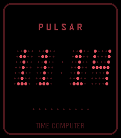
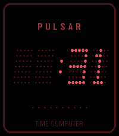
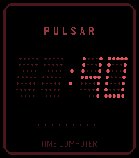
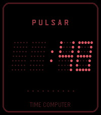
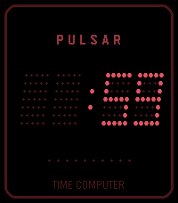

# Pulsar 1970 (Pebble Time 2 / Pebble Time Watchface)


A high-fidelity retro digital watchface inspired by the iconic **1970s Hamilton Pulsar** ("Time Computer" P1, P2, and P3 models)—the world's first commercial digital LED wristwatch.

Built for the **Rebble / RePebble** ecosystem with native support for the **Pebble Time 2 (`emery`)**, **Pebble Time (`basalt`)**, **Pebble 2 (`diorite`)**, **Pebble Time Round (`chalk`)**, and classic **Pebble (`aplite`)**.

---

## Features & Configurable Capabilities

### 1. Authentic 1970s LED Matrix & Visuals
- **5×7 GaAsP Dot-Matrix LEDs:** Mathematically rendered circular LED dies that scale crisply across all display resolutions.
- **Authentic ~6° Vintage Italic Slant:** Replicates the physical rightward die tilt characteristic of 1970s Litronix/Bowmar LED modules (toggleable in settings).
- **GaAsP Ghost Matrix:** Unlit LED dies are rendered in deep maroon (`GColorBulgarianRose`) on a pitch-black background (`GColorBlack`), mimicking unlit semiconductor dies beneath synthetic ruby mineral crystal.
- **Vintage Cushion Bezel Chamfer:** Double-bezel inner highlight tailored to the Pebble Time 2 screen geometry.
- **Customizable Bezel Footer:** Choose between `TIME COMPUTER` (1972 Hamilton homage), `HAMILTON`, `PULSAR`, or `None (Clean / Minimal)`. Vertically centered with generous breathing room above the lower bezel border.

### 2. Multi-Mode Display Engine (Wrist Flick / Tap)
Cycle through 5 interactive display modes via wrist flick or tap:
1. **Time Mode (`HH:MM`):** 12h/24h time with blinking GaAsP colon and AM/PM LED indicator dot.
2. **Live Seconds Mode (`:SS`):** Real-time ticking seconds counter.
3. **Calendar Date Mode (`MM DD`):** Space-age month and day readout.
4. **Step Counter Mode (`08420`):** 5-digit daily step count powered by the Pebble Health API.
5. **Battery Level Mode (` 85 %` / `100 %`):** Digital battery percentage monitor.

### 3. LED Colorways
- **Ruby Red (GaAsP 1972):** Default deep red semiconductor LED with maroon ghost dies.
- **Prototype Green (GaP 1975):** Vintage green LED homage.
- **Amber Gold (HP-01 Style):** Warm golden-yellow space-age calculation watch homage.
- **Cobalt Blue:** Modern electric blue styling.

### 4. Health & Alerts
- **10-Dot Micro-LED Step Progress Bar:** 10 discrete micro-dots showing daily progress towards a configurable step goal (5,000 to 15,000 steps).
- **Stealth Push-to-Wake Mode:** Replicates the original Pulsar power-saving behavior—display remains dark until awakened for 4 seconds by wrist movement.
- **Hourly Vibration Chime:** Configurable silent hourly alert (Off, Single Pulse, Double Pulse).
- **Status Indicators:** Subtle LED status dots for Bluetooth disconnect and battery low (<20%).

---

## Modes Preview

| Time (`HH:MM`) | Seconds (`:SS`) | Date (`MM DD`) | Steps (`08420`) | Battery (`85%`) |
| :---: | :---: | :---: | :---: | :---: |
|  |  |  |  |  |

---

## Developer Workflow & Direct Installation

This repository uses [`devenv.nix`](devenv.nix) providing the official ARM GCC toolchain and Pebble SDK 4.33.1.

### 1. Build Watchface Bundle
```bash
devenv shell -- pebble build
```
This produces `build/pebble-pulsar.pbw` containing binaries and Clay configuration for all platforms (`emery`, `basalt`, `diorite`, `chalk`, `aplite`).

### 2. Test in Emulator
```bash
# Pebble Time 2 (200x228 Color)
devenv shell -- pebble install --emulator emery

# Simulate wrist flick / tap
devenv shell -- pebble emu-tap --emulator emery --direction x+
```

### 3. Direct Watch Installation (Standard WiFi Developer Bridge)
To flash the watch directly without manual web downloads:
1. Ensure the Pebble mobile app is open with **Developer Connection** enabled (Settings → Developer Connection).
2. Run the direct installer:
```bash
devenv shell -- python3 scripts/install_watch.py <PHONE_IP>
```
This uses the official `libpebble2` protocol engine to stream the app via `PutBytes` and register it in the watch's internal `BlobDB` database.

---

## Rebble App Store Distribution

To distribute **Pulsar 1970** to all Pebble users worldwide:

1. **Rebble Developer Portal:**
   - Log in at [dev-portal.rebble.io](https://dev-portal.rebble.io/) using your Rebble account.
2. **Create New Application:**
   - Select **Watchface**.
   - Upload `build/pebble-pulsar.pbw`.
   - Title: **Pulsar 1970**
   - Description: Highlight the 1970s Hamilton Pulsar heritage, 5 interactive modes, and customizable colorways.
   - Screenshots: Upload the provided screenshots from the `screenshots/` directory.
3. **Publish:**
   - Once submitted, the watchface is immediately indexable in the Rebble App Store and installable directly from the mobile Pebble app with working Clay settings.

---

## Historical Note: Why "TIME COMPUTER"?

When the Hamilton Watch Company unveiled the original Pulsar in 1970 on the *Tonight Show Starring Johnny Carson*, it had no moving parts, gears, or hands—an unprecedented leap in electronics. In 1972, Hamilton incorporated the dedicated subsidiary **"Pulsar Time Computer, Inc."** All original P1, P2 ("Astronaut"), and P3 timepieces were branded as *Pulsar Time Computers*.

---

## License

MIT © Travers McInerney
