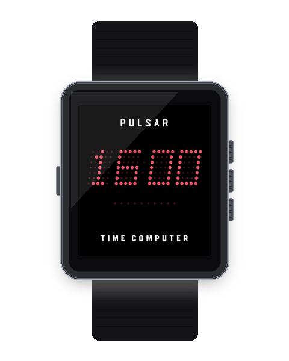
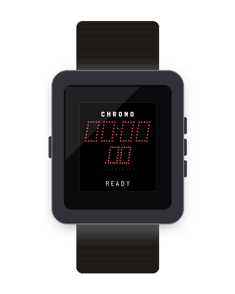
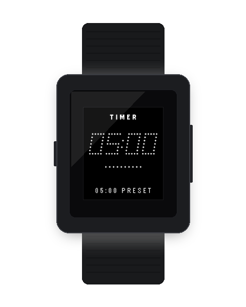
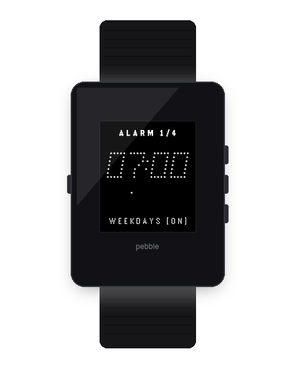

# Pebble Pulsar Suite ⚡

<p align="center">
  
</p>

<p align="center">
  
  
  
  
</p>

<p align="center">
  <em>The complete 1970s Hamilton Pulsar Solid-State LED Suite for Pebble OS: <strong>Watchface</strong>, <strong>Chronograph</strong>, <strong>Countdown Timer</strong>, and <strong>Multi-Alarm Clock</strong>.</em>
</p>

---

## 🏛️ Suite Applications & Independent Versioning

Every application in the **Pebble Pulsar Suite** is an independently versioned and releasable Pebble package with its own dedicated documentation, changelog, and asset pipeline:

| Application | Path | Current Version | Changelog | Documentation | Tag Pattern |
| :--- | :--- | :--- | :--- | :--- | :--- |
| **[Pulsar 1970 Watchface](apps/watchface)** | `apps/watchface/` | `v2.2.0` | [`CHANGELOG.md`](apps/watchface/CHANGELOG.md) | [`README.md`](apps/watchface/README.md) | `watchface-v*` |
| **[Pulsar Chronograph](apps/chrono)** | `apps/chrono/` | `v1.1.0` | [`CHANGELOG.md`](apps/chrono/CHANGELOG.md) | [`README.md`](apps/chrono/README.md) | `chrono-v*` |
| **[Pulsar Countdown Timer](apps/timer)** | `apps/timer/` | `v1.0.0` | [`CHANGELOG.md`](apps/timer/CHANGELOG.md) | [`README.md`](apps/timer/README.md) | `timer-v*` |
| **[Pulsar Multi-Alarm Clock](apps/alarm)** | `apps/alarm/` | `v1.0.0` | [`CHANGELOG.md`](apps/alarm/CHANGELOG.md) | [`README.md`](apps/alarm/README.md) | `alarm-v*` |

---

## 🚀 Release Lifecycle & Git Tagging

Each app can be released independently without bumping or rebuilding unrelated apps:

```bash
# 1. Update version in apps/<app>/package.json and apps/<app>/CHANGELOG.md
# 2. Capture & validate new assets:
npm run assets:chrono

# 3. Commit, tag, and push:
git commit -am "chore(chrono): release v1.1.0"
git tag -a chrono-v1.1.0 -m "Release Pulsar Chronograph v1.1.0"
git push origin main
git push origin chrono-v1.1.0
```

GitHub Actions automatically parses the tag, compiles `pebble-pulsar-chrono.pbw`, executes firmware verification, and publishes the GitHub Release.

For complete release instructions, see [**`docs/RELEASE_WORKFLOW.md`**](docs/RELEASE_WORKFLOW.md).

---

## 🎨 Validated Screenshot & Asset Pipeline

To prevent blank, unpainted, or corrupted screenshots, [`scripts/generate_app_assets.py`](scripts/generate_app_assets.py) includes a content verification engine that tests image dimensions, active LED pixel density, and color variance:

```bash
# Capture, validate, and composite 3D device frames for a single app:
npm run assets:watchface
npm run assets:chrono
npm run assets:timer
npm run assets:alarm

# Capture and validate all apps in parallel:
npm run assets:all
```

For asset architecture details, see [**`docs/ASSET_PIPELINE.md`**](docs/ASSET_PIPELINE.md).

---

## 📂 Standardized Asset Directory Structure

```
screenshots/
├── suite/                       # Multi-app marketing graphics & Rebble Store banners
├── mockups/                     # Authentic 3D device frames per app (Time 2, Basalt, Diorite, Aplite)
│   ├── watchface/
│   ├── chrono/
│   ├── timer/
│   └── alarm/
├── watchface/                   # Validated raw emulator stills (Time, Sec, Date, Steps, Batt)
├── chrono/                      # Validated raw emulator stills (Ready, Running, Lap, Review)
├── timer/                       # Validated raw emulator stills (Preset, Running, Firing)
└── alarm/                       # Validated raw emulator stills (Slots, Edit, Ringing)
```

---

## 🛠️ Monorepo Quick Commands

| Task | Command |
| :--- | :--- |
| **Build Entire Suite** | `npm run build` |
| **Build Target App** | `npm run build:watchface`<br>`npm run build:chrono`<br>`npm run build:timer`<br>`npm run build:alarm` |
| **Run Firmware Tests** | `npm test` |
| **Validate PBWs** | `npm run validate:pbw` |
| **Generate Validated Assets** | `npm run assets:<app>` or `npm run assets:all` |

---

## 📜 License

MIT © [Travers McInerney](https://github.com/traversm)
