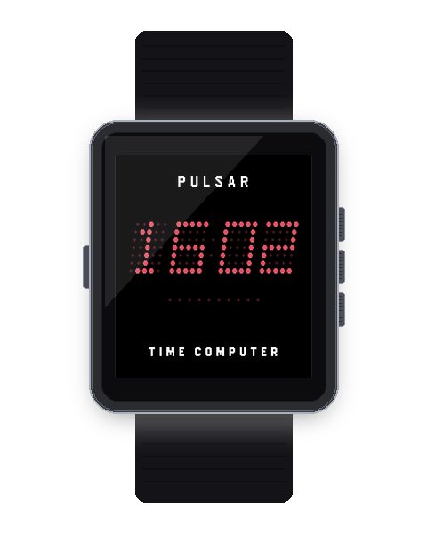
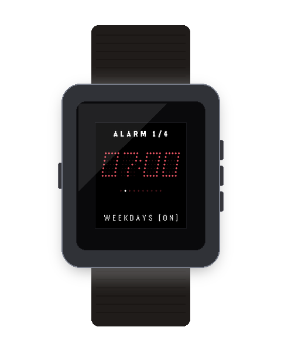

# Pulsar Multi-Alarm Clock `v1.0.0`

<p align="center">
  
  
</p>

A multi-schedule vintage LED alarm clock for Pebble OS styled after the 1970s Hamilton Pulsar digital timepieces.

---

## ⚡ Features

- **4 Independent Alarm Slots:** Configure up to 4 discrete alarms with custom times and repeat schedules.
- **4 Flexible Schedules:** `DAILY`, `WEEKDAYS` (Mon-Fri), `WEEKENDS` (Sat-Sun), and `ONCE`.
- **Pebble Wakeup API:** Reliable background alarms that launch the app and alert even during sleep or standby.
- **Vintage 9-Minute Snooze:** Authentic mechanical snooze duration, configurable via Clay (5m, 9m, 10m, 15m).
- **In-App Dial Edit Mode:** Interactive hour/minute editing with blinking cursor feedback.
- **Escalating Synth & Haptic Curve:** Gentle initial tone pulse escalating to urgent wake alerts.

---

## 🎮 Hardware Controls

| Button | Screen | Action |
| :--- | :--- | :--- |
| **UP / DOWN** | Slot List | Navigate between Alarm Slots 1–4 |
| **SELECT** | Slot List | **Toggle On / Off** selected alarm slot |
| **SELECT (Hold)** | Slot List | **Enter Edit Mode** for selected alarm |
| **UP / DOWN** | Edit Mode | Adjust active digit (Hours / Minutes / Schedule) |
| **SELECT** | Edit Mode | Advance cursor to next field / Confirm |
| **SELECT** | Firing Alarm | **Snooze** alarm (+9 minutes) |
| **BACK / DOWN** | Firing Alarm | **Dismiss** alarm |

---

## ⚙️ Clay Configuration Keys

| Key | Description | Type | Default |
| :--- | :--- | :--- | :--- |
| `AppKeyColorway` | LED Palette (Ruby, Lava, Green, Gold, Blue, Lunar, Paper) | select | GaAsP Ruby Red (`0`) |
| `AppKeyItalicSlant` | 12° Italic Display Slant | toggle | Enabled (`true`) |
| `AppKeyAudioEnabled` | Buzzer alarm synth tones (Pebble Time 2) | toggle | Enabled (`true`) |
| `AppKeyVibeEnabled` | Escalating wake haptics | toggle | Enabled (`true`) |
| `AppKeySnoozeDuration` | Snooze duration (5, 9, 10, 15 minutes) | select | 9 Minutes (`9`) |

---

## 📦 Building & Asset Commands

```bash
# Build app PBW bundle
npm run build:alarm

# Capture and validate screenshots + generate 3D hardware mockups
npm run assets:alarm
```
