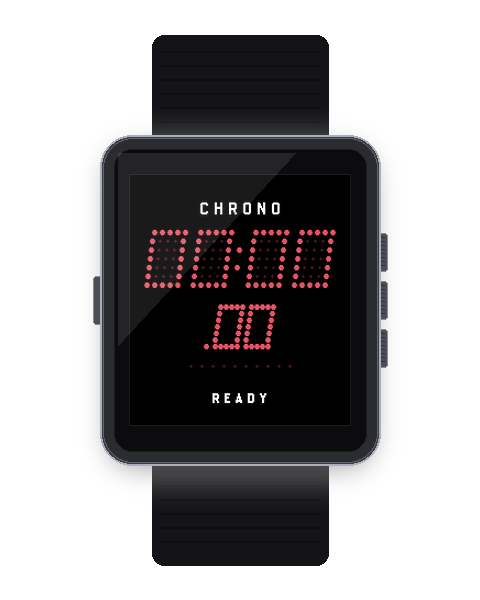

# Pulsar Chronograph (Stopwatch) `v1.1.0`

<p align="center">
  
  
</p>

A precision digital chronograph and lap timer for Pebble OS styled after the 1970s Hamilton Pulsar LED digital chronometers.

---

## ⚡ Features

- **Centisecond Precision:** 50ms (20fps) high-frequency refresh loop displaying elapsed time in `MM:SS.cc`.
- **Automatic Hours Scaling:** Seamlessly switches to `HH:MM :SS` format when timing exceeds 60 minutes, displaying the `CHRONO [HR]` indicator.
- **Live Lap Split Freeze:** Pressing `UP` during active timing records a lap split (up to 20 laps) and freezes the split time on-screen for 3 seconds while background timing continues unaffected.
- **Interactive Lap Review Browser:** When stopped, press `UP` or `DOWN` to cycle through recorded splits (`LAP 01`, `LAP 02`, etc.) with the fastest split highlighted as `[BEST]`.
- **10-Dot Micro-LED Tachymeter Chaser:** Real-time optical bead animation visualizing sub-second momentum.
- **Zero-Drift Background Persistence:** Exiting or switching apps preserves elapsed time and running state via epoch timestamps with zero battery drain.
- **Always-On Backlight Setting:** Toggleable backlight hold to keep the screen visible during continuous workouts.
- **Retro Synth Audio & Tactile Haptics:** Discrete toggles for buzzer audio tones and vibration pulses.

---

## 🎮 Hardware Controls

| Button | Timing State | Action |
| :--- | :--- | :--- |
| **SELECT** | Stopped | **Start** chronograph timing loop |
| **SELECT** | Running | **Stop** chronograph timing loop |
| **UP** | Running | **Record Lap Split** (freezes split readout on screen for 3s) |
| **UP** | Stopped | **Browse Previous Lap** in lap review browser |
| **DOWN** | Stopped | **Browse Next Lap** in lap review browser |
| **DOWN** | Stopped (at reset) | **Reset** display to `00:00.00` |
| **DOWN (Hold 600ms)** | Stopped | **Clear All Laps** from memory and flash storage |
| **BACK** | Any | Return to watchface (timing continues safely in background) |

---

## ⚙️ Clay Configuration Keys

| Key | Description | Type | Default |
| :--- | :--- | :--- | :--- |
| `AppKeyColorway` | LED Palette (Ruby, Lava, Green, Gold, Blue, Lunar, Paper) | select | GaAsP Ruby Red (`0`) |
| `AppKeyItalicSlant` | 12° Italic Display Slant | toggle | Enabled (`true`) |
| `AppKeyAudioEnabled` | Actuation buzzer tones (Pebble Time 2) | toggle | Enabled (`true`) |
| `AppKeyVibeEnabled` | Haptic actuation vibration | toggle | Enabled (`true`) |
| `AppKeyBacklightAlwaysOn` | Hold display backlight on while app is active | toggle | Disabled (`false`) |

---

## 📦 Building & Asset Commands

```bash
# Build app PBW bundle
npm run build:chrono

# Capture and validate screenshots + generate 3D hardware mockups
npm run assets:chrono
```
