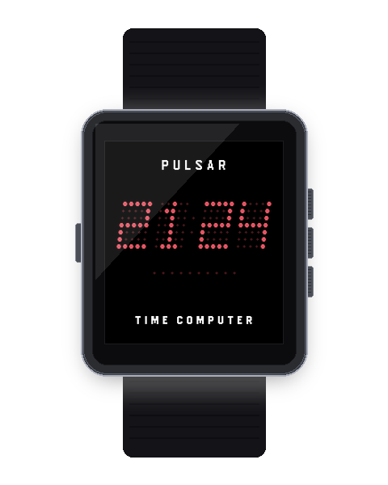
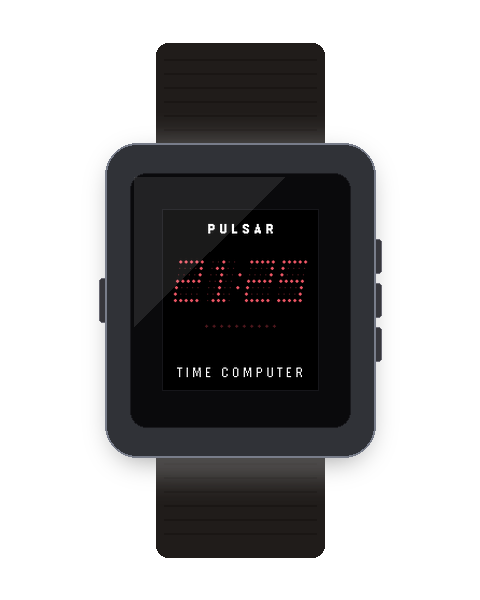

# Pulsar Countdown Timer `v1.0.0`

<p align="center">
  
  
</p>

A vintage LED countdown timer and Pomodoro focus tool for Pebble OS styled after the 1970s Hamilton Pulsar digital instruments.

---

## ⚡ Features

- **15 Quick Duration Presets:** Instant selection for short intervals (`00:10`, `00:30`, `00:45`), standard intervals (1m, 2m, 3m, 5m, 10m, 15m, 20m, 30m, 45m, 60m, 90m), and Pomodoro (25m).
- **Interactive Custom Duration Editor:** Long-press SELECT (500ms) to dial in exact minutes (0–99) and seconds (0–59) with blinking LED digits.
- **10-Dot Micro-LED Depletion Gauge:** Progressive optical bead depletion visualizing remaining countdown proportion.
- **Pebble Wakeup API Integration:** Safely schedules hardware wakeups and alerts when time is up even if you exit the app.
- **Ascending 3-2-1 Audio Warning:** Warning audio beeps at 3s, 2s, 1s leading into timer completion.
- **Escalating Ruby Alarm Pulse:** Pulsing red LED display alert with buzzer synth tones, backlight illumination, and repeating haptic vibration pattern.
- **Quick Time Adjust:** Add or subtract +15s / +1m on the fly during active countdowns.

---

## 💡 Background Wakeup Behavior & Foreground Mode

- **Foreground / Desk Timer Mode**: Keep Pulsar Timer open while cooking, working out, or focusing. When time is up, it immediately triggers the **full 30-second continuous alarm loop** with vibrating pulses, audio chimes, glowing backlight, and flashing banners.
- **Background Wakeup Mode**: If you switch back to your watchface while a timer is running, Pebble OS displays a **system wakeup notification card** with an alert tone/buzz when time expires. Pressing **SELECT** launches into the full 30-second Pulsar alarm sequence.

## 🎮 Hardware Controls

| Button | Mode | Action |
| :--- | :--- | :--- |
| **UP / DOWN** | Preset Select | Cycle duration presets (1m to 60m) |
| **SELECT** | Preset Select | **Start** countdown timer |
| **UP / DOWN** | Running | **+1m / -1m** time adjustment |
| **SELECT** | Running | **Pause / Resume** countdown |
| **SELECT (Hold)** | Paused | **Reset** timer to preset selection |
| **ANY BUTTON** | Firing Alarm | **Dismiss** alarm alert |

---

## ⚙️ Clay Configuration Keys

| Key | Description | Type | Default |
| :--- | :--- | :--- | :--- |
| `AppKeyColorway` | LED Palette (Ruby, Lava, Green, Gold, Blue, Lunar, Paper) | select | GaAsP Ruby Red (`0`) |
| `AppKeyItalicSlant` | 12° Italic Display Slant | toggle | Enabled (`true`) |
| `AppKeyAudioEnabled` | Buzzer countdown and alarm tones (Pebble Time 2) | toggle | Enabled (`true`) |
| `AppKeyVibeEnabled` | Haptic actuation and alarm vibration | toggle | Enabled (`true`) |

---

## 📦 Building & Asset Commands

```bash
# Build app PBW bundle
npm run build:timer

# Capture and validate screenshots + generate 3D hardware mockups
npm run assets:timer
```
