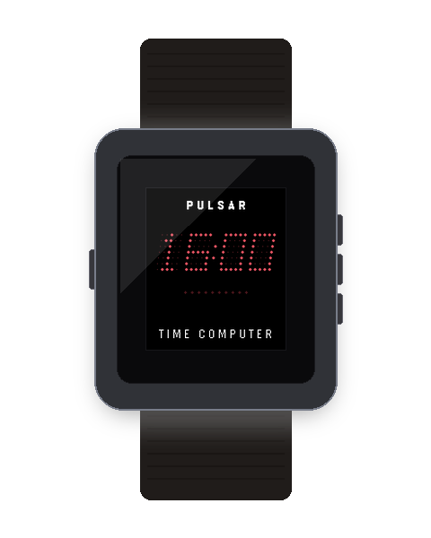

# Pulsar 1970 Watchface `v2.2.0`

<p align="center">
  
  
</p>

An authentic procedural LED digital watchface for Pebble OS recreating the legendary 1970 Hamilton Pulsar Time Computer.

---

## ⚡ Features

- **Procedural 5x7 GaAsP Dot-Matrix Font:** Authentic red micro-LED rendering with zero bitmap bloat.
- **6 Configurable Operating Modes:** Time (`HH:MM`), Live Seconds (`:SS`), Calendar Date (`MM.DD`), Step Count (`STEPS`), Battery Percentage (`BATT`), and Heart Rate (`BPM`).
- **Pebble Health 10-Dot Progress Gauge:** Micro-LED bead bar tracking daily step goal progress with Overdrive celebration animation upon reaching 100%.
- **Wrist Flick / Tap Gesture Cycling:** Seamlessly switch through modes with customizable flick gestures or automatic timeout return.
- **Clock-Synchronized Charging Animations:** Cylon chaser, Theater marquee, and Heartbeat charging pulses.
- **8-Bit Retro Synth Audio:** Hourly tone chimes, step celebration fanfares, and Bluetooth disconnect alerts on speaker-equipped hardware (Pebble Time 2 `emery`).
- **7 Vintage Colorways:** GaAsP Ruby Red, Hot Lava, GaP Green, Amber Gold, Cobalt Blue, Lunar White, and Inverted High-Contrast Paper.

---

## ⚙️ Clay Configuration Keys

| Key | Description | Type | Default |
| :--- | :--- | :--- | :--- |
| `AppKeyOperatingMode` | Default display mode | select | Time (`0`) |
| `AppKeyColorway` | LED color palette | select | GaAsP Ruby Red (`0`) |
| `AppKeyFlickAction` | Wrist flick action (Cycle, Seconds, Date, Steps, Battery) | select | Cycle Modes (`0`) |
| `AppKeyItalicSlant` | 12° Italic Display Slant | toggle | Enabled (`true`) |
| `AppKeySoundEnabled` | 8-bit audio synth effects (Pebble Time 2) | toggle | Enabled (`true`) |
| `AppKeyHourlyBeep` | Hourly audio chime | toggle | Enabled (`true`) |
| `AppKeyHourlyVibe` | Hourly haptic vibration pulse | toggle | Enabled (`true`) |
| `AppKeyStepGoal` | Daily Pebble Health step target | number | `10000` |

---

## 📦 Building & Asset Commands

```bash
# Build app PBW bundle
npm run build:watchface

# Capture and validate screenshots + generate 3D hardware mockups
npm run assets:watchface
```
