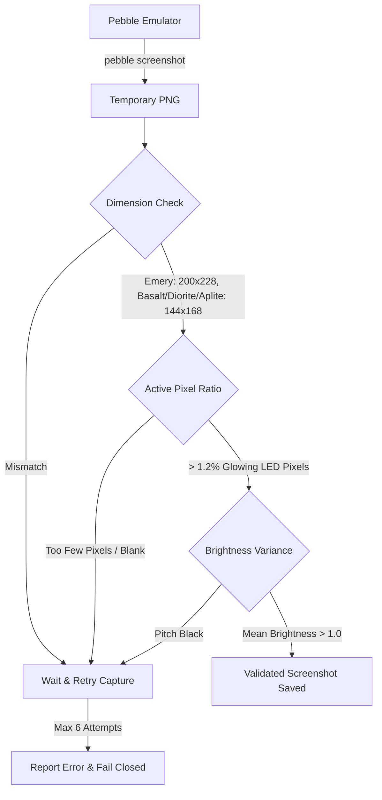

# Pebble Pulsar Suite — Screenshot & Asset Pipeline

This document details the automated screenshot generation, validation engine, and 3D device mockup compositing workflow.

---

## 🎨 Asset Hierarchy & Directory Structure

All visual assets and screenshots are organized into a standardized directory tree:

```
screenshots/
├── suite/                       # Multi-app marketing graphics & Rebble Store assets
│   ├── appstore-banner-720x320.png
│   ├── store-icon-260x260.png
│   └── pulsar-all-platforms-mockup.png
├── mockups/                     # Composite 3D hardware device frames
│   ├── watchface/               # Watchface in Pebble Time 2, Time Steel, Pebble 2, Classic
│   ├── chrono/                  # Chrono in Pebble Time 2, Time Steel, Pebble 2, Classic
│   ├── timer/                   # Timer in Pebble Time 2, Time Steel, Pebble 2, Classic
│   └── alarm/                   # Alarm in Pebble Time 2, Time Steel, Pebble 2, Classic
├── watchface/                   # Raw emulator stills & animated GIFs (Time, Sec, Date, Steps, Battery)
├── chrono/                      # Raw emulator stills & animated GIFs (Ready, Running, Lap, Review)
├── timer/                       # Raw emulator stills & animated GIFs (Preset, Running, Firing)
└── alarm/                       # Raw emulator stills & animated GIFs (Slots, Edit, Ringing)
```

---

## 🛡️ Validation Engine Architecture

To prevent capturing corrupted, blank, bootstrapping, or menu-transitioning frames, [`scripts/generate_app_assets.py`](../scripts/generate_app_assets.py) runs every captured frame through a multi-point verification engine:



### Validation Rules:
1. **Dimensions Parity:** Validates exact display geometries (`200x228` for Emery, `144x168` for Basalt, Diorite, Aplite).
2. **Active LED Pixel Ratio:** Calculates the ratio of glowing LED pixels ($RGB > 28$). Rejects blank screens, transitional flickers, or unpainted frames.
3. **Bootstrapping / Loader Filtering:** Verifies that content exists across the procedural matrix bounding area rather than a system loading animation.
4. **Automatic Retry with Backoff:** Re-attempts capture up to 6 times if the emulator is still in the middle of a window animation or cold boot.

---

## 💻 Running the Asset Pipeline

### 1. Capture & Validate a Single App
```bash
# Capture and validate Chronograph stills and generate 3D device mockups:
npm run assets:chrono

# Or directly:
devenv shell -- python3 scripts/generate_app_assets.py chrono
```

### 2. Capture & Validate All Suite Apps
```bash
npm run assets:all
# Or:
devenv shell -- python3 scripts/generate_app_assets.py all
```

### 3. Generate Multi-App Marketing Assets & Animated GIFs
```bash
devenv shell -- python3 scripts/generate_store_assets.py
devenv shell -- python3 scripts/generate_perfect_gifs.py
```
